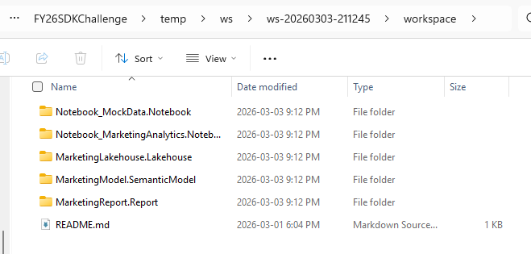
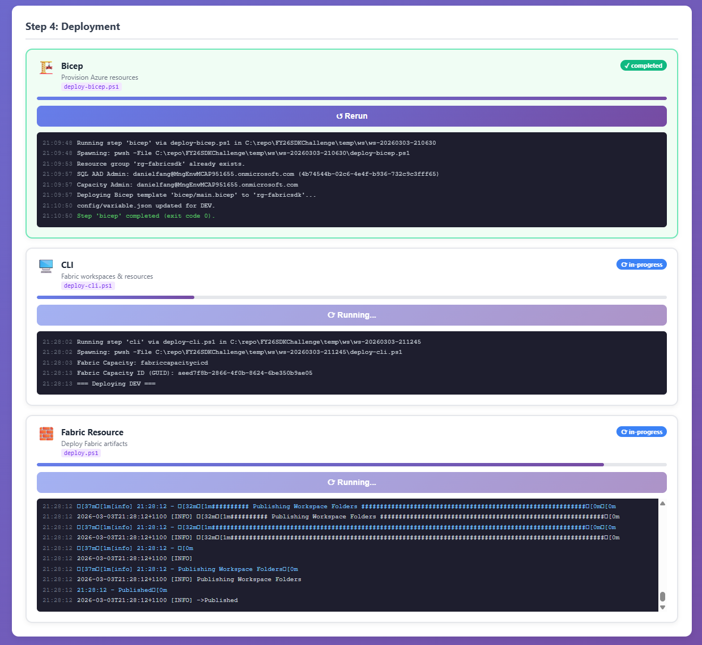
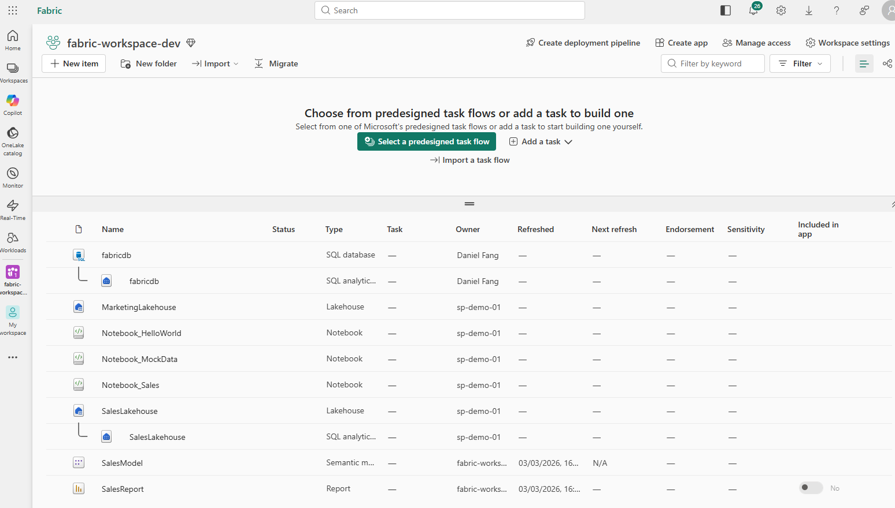

# Fabric Automation App

Automates Microsoft Fabric resource deployment using GitHub Copilot CLI SDK. Describe deployment requirements in natural language and let Copilot generate and execute deployment plans.

## The Challenge

Getting a Microsoft Fabric analytics solution into production is harder than it should be. The platform spans Azure infrastructure, Fabric workspaces, and a growing catalog of data artifacts — but there is no single tool that ties them all together. Teams face a fragmented process:

- **Azure provisioning is disconnected from Fabric setup.** Capacity, resource groups, and networking are managed in the Azure portal or with Bicep/ARM templates, while workspaces and permissions live inside the Fabric admin experience. These two worlds use different APIs, different auth models, and different deployment patterns.
- **Workspace configuration is manual and click-heavy.** Creating a workspace, linking it to a Git repo, assigning capacity, and enabling CI/CD pipelines all require navigating multiple Fabric portal screens. There is no declarative "desired state" file that captures the full workspace definition.
- **Artifact creation happens in yet another context.** Lakehouses, data pipelines, notebooks, and semantic models are built inside the Fabric portal's item editors. Moving them from dev to test to production means exporting, re-importing, or relying on deployment pipelines that still require manual wiring.
- **Reproducibility is low.** Because the process is spread across three tools and dozens of manual steps, re-creating an identical environment for a new project, a new region, or a disaster-recovery scenario is time-consuming and error-prone.
- **Onboarding is slow.** A new data engineer must learn Azure resource management, Fabric administration, and artifact authoring before they can stand up their first workspace — a steep learning curve that delays productivity.

The result: what should be a straightforward "give me a lakehouse with a pipeline" request turns into hours of portal navigation, script cobbling, and tribal knowledge.

## How This App Solves It

1. **Create Azure resources** — provision Fabric capacity, resource groups, and supporting infrastructure via the Azure portal or CLI.
2. **Create Fabric workspace structure** — set up workspaces, configure Git integration, and wire up CI/CD automation inside Fabric.
3. **Create Fabric artifacts** — manually build lakehouses, pipelines, notebooks, and other items through the Fabric portal.

Each step uses different tools, different UIs, and different skill sets — making the end-to-end process slow, error-prone, and hard to reproduce.

This app combines all three into a single-click workflow by unifying **Bicep** (Azure infrastructure), **Fabric CLI/API** (workspace and artifact creation), and **Fabric CI/CD automation** (Git-based version control and deployment pipelines). Describe what you need in a prompt, and the tool handles the rest:

- **Prompt-driven creation** — Fabric resources are generated directly from your natural-language description, no portal clicking required.
- **Git-backed version control** — all generated code and configuration live in a Git repo, giving your team full history, branching, and pull-request reviews.
- **Single-click streamline** — one action triggers Azure provisioning, workspace setup, and artifact deployment together, eliminating manual handoffs.
- **Faster onboarding** — new team members describe what they need in plain English instead of learning three different toolchains.
- **Consistent environments** — AI-generated deployment plans follow best practices, reducing configuration drift across workspaces.
- **Repeatable workflows** — capture and replay deployment patterns so common setups (analytics lakehouse, ingestion pipeline, dev notebooks) are always one click away.
- **Built-in intelligence** — powered by GitHub Copilot, the tool understands intent and adapts plans to your specific requirements without manual template editing.

Whether your team manages two workspaces or two hundred, this app turns hours of fragmented manual provisioning into minutes of guided, end-to-end automation.

## Prerequisites

- Node.js v18+
- GitHub Copilot CLI installed and authenticated (`gh copilot --version`)
- Microsoft Fabric access (optional, for actual deployment)

## Getting Started

```bash
git clone https://github.com/qkfang/FY26SDKChallenge.git
cd FY26SDKChallenge
npm install
npm run dev
```

- Frontend: http://localhost:3000
- Backend: http://localhost:3001

## Usage

1. Open http://localhost:3000
2. Describe your Fabric deployment in natural language
3. Click "Start Deployment"
4. Monitor real-time progress
5. Review the generated plan and deployed resources

## Tech Stack

- **Frontend**: React, TypeScript, Vite
- **Backend**: Node.js, Express, TypeScript, GitHub Copilot CLI SDK
- **Shared**: Common TypeScript types

## Screenshots

### Step 1 — Enter Requirements


### Step 2 — Requirements


### Step 3 — Workspace




### Step 4 — Deployment


### Step 5 — Fabric Portal

