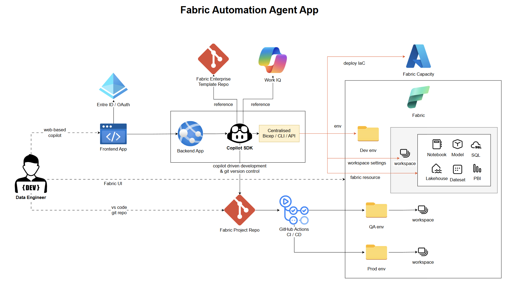
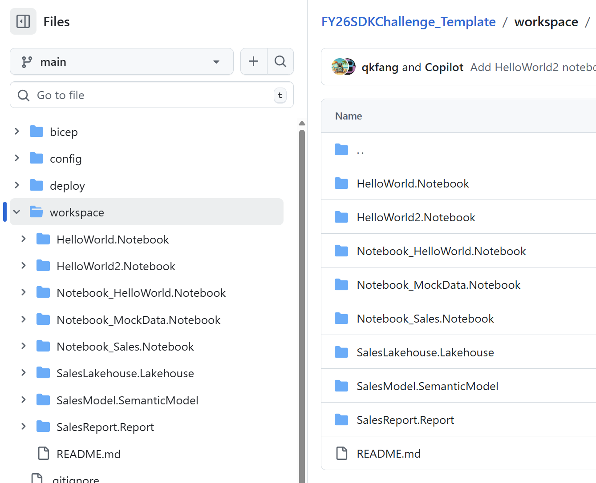

# Fabric Automation Agent App

**Agent-driven automation app that turns Microsoft Fabric delivery from a manual, multi-tool process into a standardized, version-controlled, end-to-end deployment workflow.**

Date engineering teams today spend hours manually setting up and deploying Microsoft Fabric environments across Azure, Fabric CLI, the Fabric portal, and Git tooling. Our solution unifies that into one web-based, agent-driven interface that automates the full workflow — from provisioning infrastructure to deploying workspaces, notebooks, lakehouses, semantic models, and Power BI reports. The result is faster delivery, fewer deployment errors, stronger governance, and a much better developer experience.

This **Fabric Automation Agent App** demonstrates how AI can move beyond simple assistance and become an **operational force multiplier** for data platforms. Rather than helping with one task at a time, the Fabric Automation Agent App helps teams automate the **entire delivery lifecycle** of a Fabric environment — from infrastructure provisioning to workspace setup to analytics asset deployment.

That makes it compelling not just as a demo, but as a practical platform with real enterprise value:

- faster project delivery
- more reliable deployments
- stronger governance
- easier scaling across teams

## Business Value

Setting up a Fabric environment manually takes **30+ portal steps and over an hour** per environment. Our agent reduces this to **5 steps in under 10 minutes**. See [02-problem.md](02-problem.md) for the full breakdown.

## Solution Design

## Screenshots

### Step 1 — Enter Requirements

### Step 2 — Requirements

### Step 3 — Workspace

### Step 4 — Deployment

### Step 5 — Fabric Portal

---

[Next: Problem & Solution →](02-problem.md)
