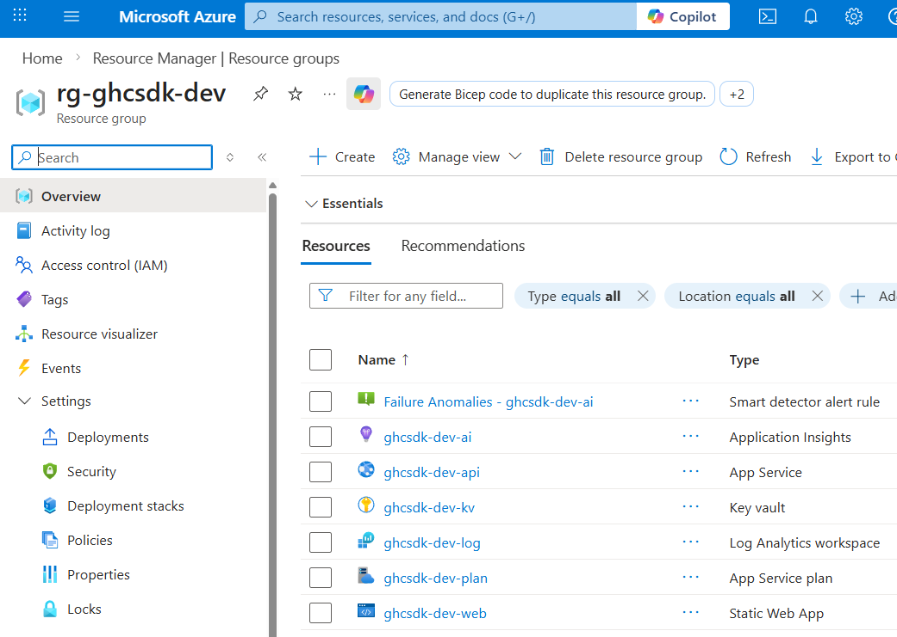
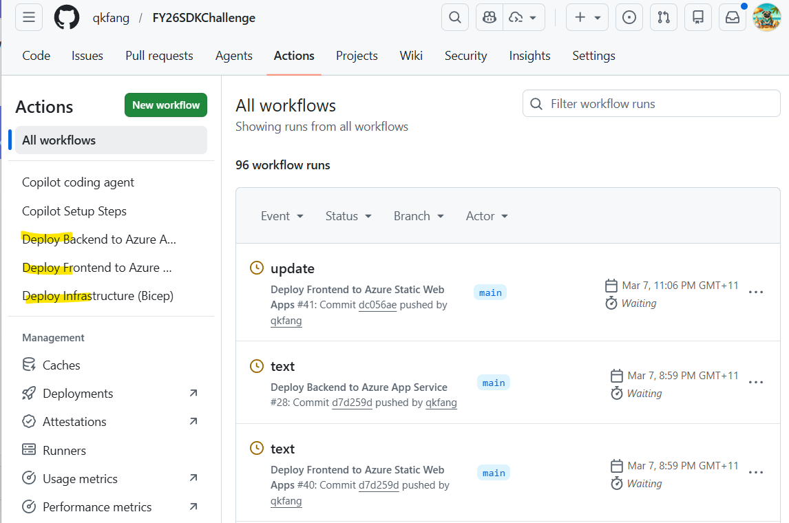
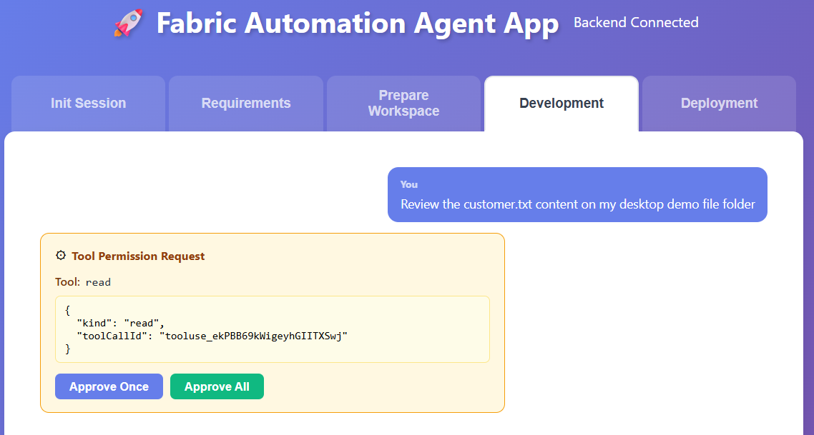
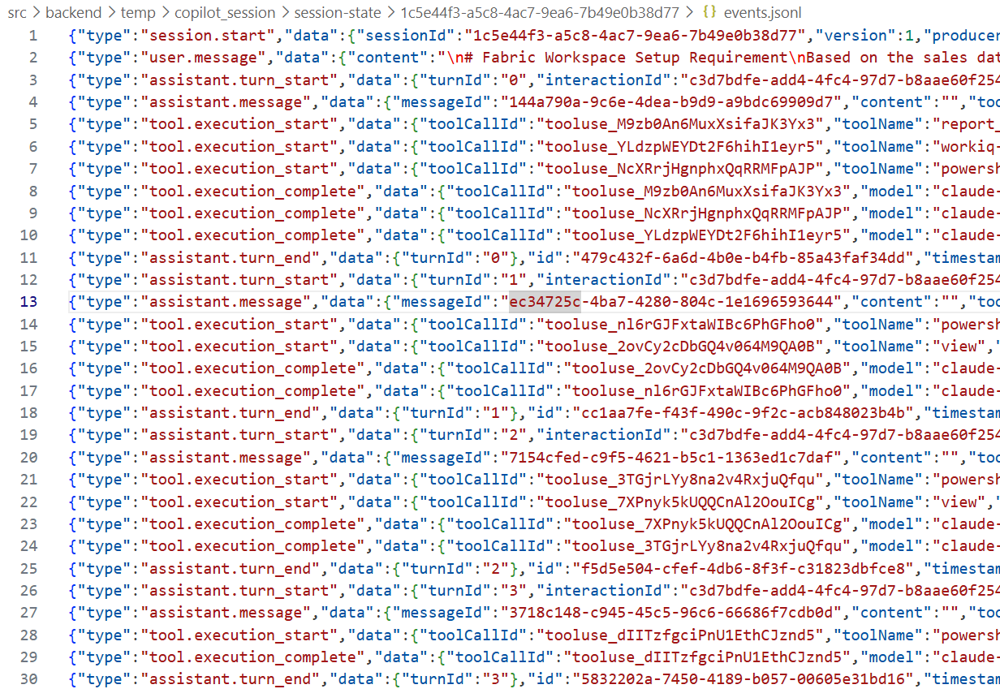
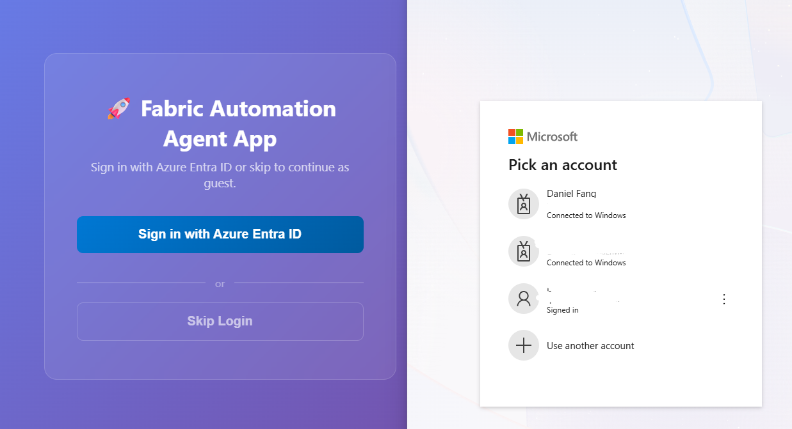

# Highlights & Differentiators

## Enterprise applicability, reusability & business value

In large financial institutions and data-driven enterprises, standing up a new Microsoft Fabric analytics environment is one of the most time-consuming, error-prone, and frustrating bottlenecks in the data engineering lifecycle. Teams spend hours manually provisioning workspaces, wiring up lakehouses, configuring semantic models, building notebooks, and then struggling to connect it all to a proper CI/CD pipeline — a process that often takes **an experienced data engineer over an hour** and leaves little room for standardization or repeatability.

This solution eliminates that bottleneck entirely. By combining a **GitHub Copilot SDK-powered conversational AI** with end-to-end Fabric automation, we deliver a single application that can:

- **Provision a complete Fabric analytics environment in under 10 minutes** — from workspace creation through lakehouse, semantic model, notebook, and Power BI report scaffolding — all version-controlled from day one.
- **Democratize DevOps for data teams** — Data engineers who traditionally lack deep experience with Git, CI/CD pipelines, and infrastructure-as-code now get a guided, AI-assisted path to production-grade workflows without needing to become platform engineers.
- **Drive enterprise standardization at scale** — Every environment created follows the same proven template: consistent naming conventions, security posture, monitoring, and deployment patterns. This turns tribal knowledge into reusable, auditable automation.

The business impact is immediate and measurable: faster time-to-insight for analytics projects, reduced operational risk from manual setup errors, and a significant reduction in the engineering hours required to onboard new Fabric workloads. For enterprises running dozens of Fabric projects across multiple teams, this translates directly into **hundreds of hours saved per quarter** and a dramatically lower barrier to entry for modern data engineering practices.

## Integration with other Azure or Microsoft solutions

This solution is deeply embedded in the Microsoft ecosystem, combining **15+ Azure and Microsoft services** into a seamless, production-ready platform:

- **Azure Static Web App** — Hosts the React frontend with global edge delivery and built-in authentication
- **Azure Web App** — Runs the Node.js backend API with auto-scaling and managed infrastructure
- **Application Insights & Log Analytics Workspace** — Full observability stack with real-time telemetry, distributed tracing, and centralized log aggregation
- **Azure Key Vault** — Secrets management for API keys, connection strings, and service credentials with zero-trust access policies
- **Microsoft Entra ID** — Enterprise-grade identity and access management with SSO, MFA, and conditional access
- **Work IQ** — Enriches copilot conversations with contextual awareness from design documents and data files
- **Microsoft Fabric** — Full lifecycle management across Workspaces, Lakehouses, Semantic Models, Power BI Reports, and Notebooks
- **GitHub Repo** — Source control backbone enabling agentic development via custom agents, skills, and instructions that guide Copilot SDK sessions
- **GitHub Actions** — Multi-environment CI/CD pipelines for infrastructure, frontend, and backend with approval gates
- **GitHub Copilot & Copilot CLI SDK** — Powers the intelligent conversational interface that orchestrates the entire provisioning and deployment workflow

## Operational readiness (deployability, observability, CI/CD)

This is not just a demo — it is built having production in mind from the ground up:

- **Infrastructure as Code (Bicep)** — All Azure resources are defined declaratively with parameterized templates supporting dev, QA, and production environments. One command deploys the entire stack.
- **Multi-environment CI/CD with GitHub Actions** — Separate pipelines for infrastructure, frontend, and backend with environment-specific configurations and **approval gates** ensuring safe promotion from dev through QA to production.
- **End-to-end observability** — The deployed application streams telemetry to Application Insights and Log Analytics Workspace, enabling real-time performance monitoring, error tracking, and usage analytics across every layer of the stack.
- **Automated deployment to Azure** — Frontend and backend are built, tested, and deployed to Azure Static Web App and Web App respectively via GitHub Actions on every merge to main. (https://victorious-mud-07576dc0f.6.azurestaticapps.net/)
- **Full copilot activity transparency** — The UI surfaces detailed copilot activity logs, giving operators and stakeholders complete visibility into every action the AI assistant takes — building trust and enabling audit trails.
- **Repeatable and portable** — The entire solution can be deployed to any Azure subscription with minimal configuration, making it ready for customer demos, internal adoption, and partner distribution.

## Security, governance & Responsible AI excellence

Security is not an afterthought — it is woven into every layer:

- **Enterprise authentication** — The frontend integrates with Microsoft Entra ID, enforcing organizational identity policies including SSO, multi-factor authentication, and conditional access before any user touches the platform.
- **Secure API communication** — The backend leverages OAuth 2.0 workflows for GitHub Copilot SDK integration, ensuring all AI interactions are authenticated and authorized through industry-standard protocols.
- **Secrets management** — All application configurations, API keys, and sensitive credentials are stored in Azure Key Vault or GitHub Actions secrets — never hardcoded, never exposed in source control.
- **Role-based access control** — Azure RBAC and Fabric workspace permissions ensure that users only access the resources and environments they are authorized to manage.
- **Agent tool call approval in the UI** — Before the copilot executes any tool action, the UI presents a permission request dialog showing the tool name and arguments, requiring explicit user approval or rejection to ensure humans remain in control of all automated operations.
- **Agent conversation logging** — Every copilot interaction is captured and persisted as structured event logs, providing a full audit trail of user messages, assistant responses, and tool executions for compliance and governance review.

## Storytelling, clarity & "amplification ready" quality

**The problem is real and urgent.** In financial services, healthcare, and retail — industries where data teams are scaling rapidly — the gap between having a Fabric license and actually delivering analytics value is enormous. Data engineers spend their most valuable hours on repetitive infrastructure setup instead of building insights. Platform teams become bottlenecks. Standards drift. Technical debt accumulates before the first query is even written.

**This solution tells a compelling story:**

1. **A data engineer opens the app and describes what they need** — "I need a lakehouse for customer transaction data with a semantic model and a Power BI report."
2. **The AI copilot takes over** — It provisions the Fabric workspace, scaffolds the lakehouse with the right schema, creates the semantic model, generates the notebook for data ingestion, and sets up the Power BI report — all from a single conversation.
3. **Everything is version-controlled and CI/CD-ready from minute one** — The generated resources are committed to a Git repository with a working deployment pipeline, ready to promote through environments with approval gates.
4. **What used to take over an hour now takes under 10 minutes** — And the output is more consistent, more secure, and more maintainable than anything done by hand.

This is not incremental improvement — it is a **step-change in how data engineering teams operate**, and it is ready to demonstrate to any enterprise audience today.

# Extras

## Use of Work IQ / Fabric IQ / Foundry IQ

Work IQ is integrated directly into the copilot experience, enabling the AI to reference uploaded design documents, data dictionaries, and schema files during conversations. This means the copilot does not operate in a vacuum — it understands the customer's specific data landscape and generates resources that align with their actual requirements, not generic templates.

## Validated with a customer

This solution was built by Solution Engineers in Sydney who work hands-on with financial services customers adopting Microsoft Fabric. It directly addresses pain points observed across multiple enterprise engagements: the complexity of setting up Fabric environments, the knowledge gap between data engineers and DevOps practices, and the need for repeatable, governed deployment workflows. The patterns here are drawn from real-world customer conversations and validated against production requirements. See [Customer Validation](09-customer-validation.md) for detailed feedback from two customers who reviewed the solution — one focused on end-to-end Fabric CI/CD orchestration, the other on agent-driven development with enterprise templates. 

## Copilot SDK product feedback

We shared feedback directly with the Copilot SDK product team via the SDK Teams channel. Two key areas were highlighted: **fan-out parallel processing with subagents** — enabling a single session to spin up multiple subagents working on parts of a problem in parallel then merging back into a shared session state, which would make complex agent workflows faster and more scalable; and **remote session state storage** — moving session state from the client to cloud-backed storage so that orchestrators can write initial context to a central store, fan work out to parallel subagents, and merge outputs back into one unified session. The SDK team acknowledged the feedback and pointed to existing fan-out support for simpler cases and Squad Docs for heavier patterns. See [Product Feedback](10-product-feedback.md)

---

[← Previous: Agent Integration](04-agent-integration.md) | [Next: Presentation →](06-ppt.md)

