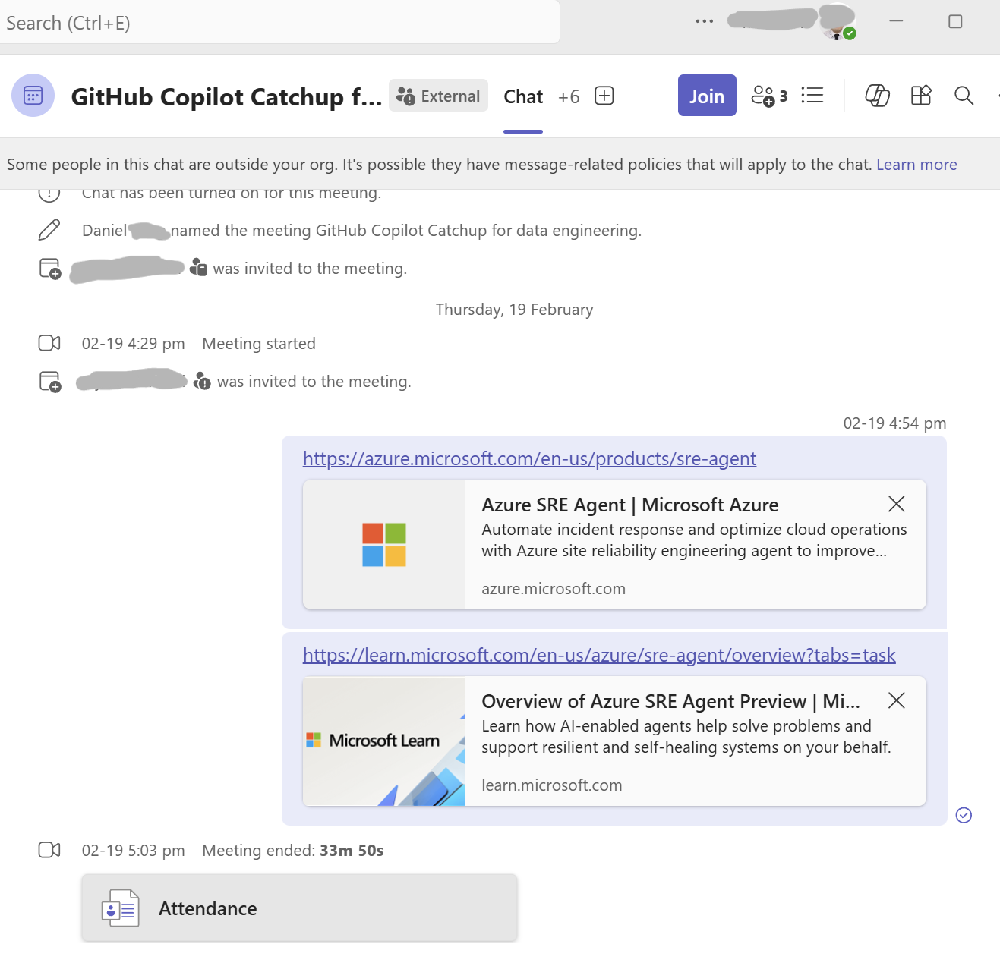
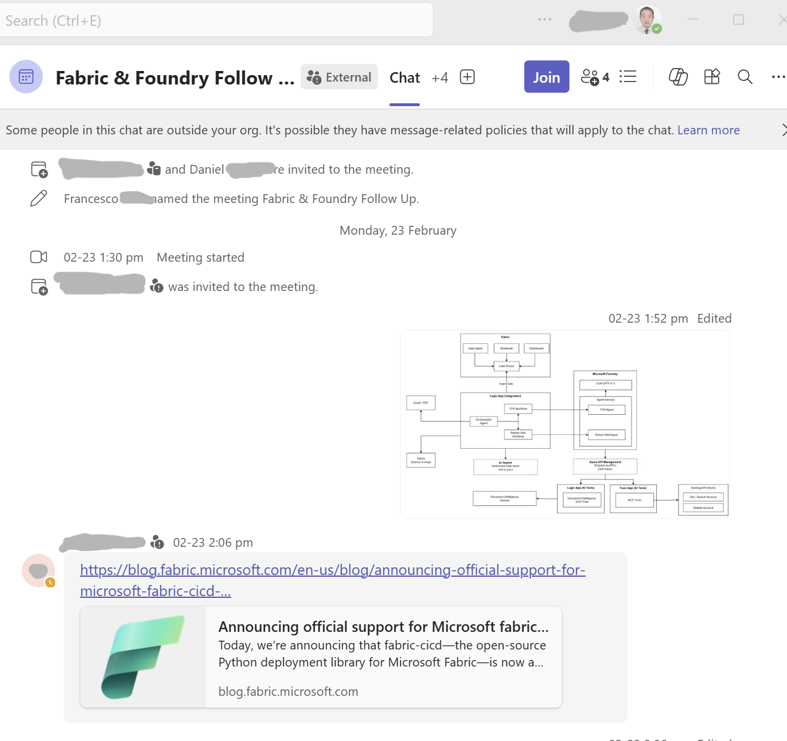

# Customer Validation and Feedback

Built by App + Data + Software Solution Engineers from Down Under who work closely with financial services customers adopting Microsoft Fabric, this solution tackles real enterprise challenges: simplifying the building, setup, and testing process, bridging data engineering and DevOps, and enabling governed, repeatable deployments for large organisations.

## Customer Pain Points

### Customer A — Agent-Driven Asset Creation

> *"How to use agents to create Fabric models & reports following defined patterns?"*

Teams want to produce lakehouses, notebooks, semantic models, and reports that follow organisation-approved patterns — but today that means copying and tweaking templates by hand. Our agent lets users describe what they need in natural language and generates compliant Fabric artifacts automatically, using skill-based templates that encode enterprise standards.

### Customer B — End-to-End CI/CD Strategy

> *"What's the strategy to manage data engineering CI/CD for Fabric? Lots of disconnected steps."*

A typical Fabric deployment spans Azure provisioning, workspace configuration, Git integration, and artifact promotion — each with its own tooling and auth model. Our solution unifies all of those disconnected steps into a single prompt-driven workflow: one action triggers Bicep infrastructure deployment, Fabric workspace setup, and CI/CD artifact publishing together.

### Customer C — Git Conflict Resolution

> *"Why can't Git integration in Fabric workspace resolve conflicts?"*

Fabric's built-in Git integration can stall when merge conflicts arise, leaving teams blocked with no clear resolution path inside the portal. By managing artifacts as code in a standard Git repo, our solution lets teams use familiar branching, PR reviews, and merge tooling to resolve conflicts outside the portal before deploying.

### Customer D — Low Git & CI/CD Maturity

> *"Our data team is very new to Git and CI/CD process, but we really need it."*

Not every data team has DevOps experience. Our agent-based web interface abstracts the complexity of Git commits, branch management, and deployment pipelines behind a simple conversational UI — so teams can adopt version control and repeatable deployments without needing to learn the underlying tooling first.

## Customer Validation

We caught up with two of the customers listed above to demo the solution and gather direct feedback.

### Customer A — Agent-Driven Fabric Development with Templates

Customer A was excited about using an agent to drive Fabric development that follows predefined templates. Their concern has been ensuring consistency and compliance across lakehouses, notebooks, semantic models, and reports created by different team members. We showed how the Copilot agent takes natural language input and generates Fabric artifacts using skill-based templates that encode enterprise standards. Customer B was particularly impressed by the conversational interface and how it lowers the barrier for data engineers who are not familiar with DevOps tooling. They expressed strong interest in piloting the agent-based workflow within their team.

### Customer B — End-to-End Fabric CI/CD

Customer B's data team has been struggling to manage the full end-to-end Fabric CI/CD lifecycle. They currently rely on a patchwork of manual steps across Azure provisioning, workspace setup, and artifact deployment — with no unified process. We walked them through how the solution orchestrates the entire pipeline from a single prompt-driven workflow: infrastructure deployment via Bicep, Fabric workspace configuration, Git integration, and artifact publishing all in one coordinated action. The team acknowledged this directly addresses their core pain point and expressed strong interest in adopting the approach for their next Fabric rollout.

---

[← Previous: Screenshots](08-screenshot.md) | [Next: Product Feedback →](10-product-feedback.md)